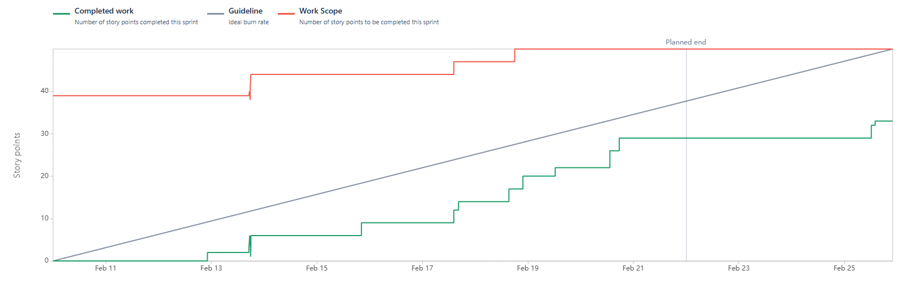
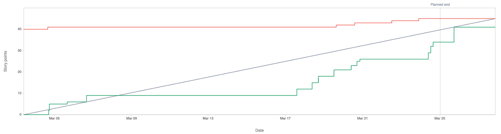
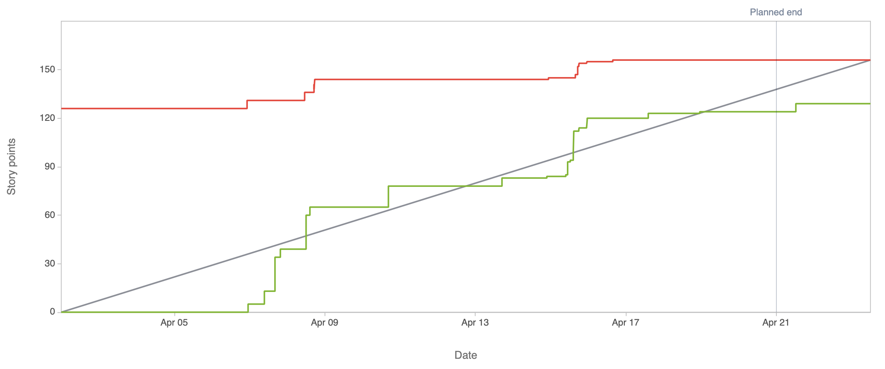

## About the Team
We have 4 team members working on the Plan-Ter project: 

* Sarahana B.
* Hannah L.
* Al-Janat O.
* Ethan W.

## Project Description
Our team is working to build a plant care planner and guidance system so that plant owners, especially new ones, can easily track and manage their plant watering schedules and care routines. Initially this will focus on houseplant enthusiasts, but will later expand to support small garden caretakers with more advanced plant care needs.

## Table of Contents
  - [General Information](#general-information)
  - [Technologies Used](#technologies-used)
  - [Features](#features)
  - [Planned Features](#planned-features)
  - [Sprint 1 Review](#sprint-1-review)
<!-- * [License](#license) -->

## General Information

*Optional: what’s missing from your project (expertise, users, additional developers, money☺, etc) that you wish you had.*

## Technologies Used
Below is a list of the technologies we plan to use for our plant care planner and guidance system. Each technology is hyperlinked to its official documentation or a relevant webpage for further reference.

### Core Technologies
- **[OpenAI ChatGPT API](https://platform.openai.com/docs/api-reference)**: We will use the ChatGPT API to provide users with intelligent guidance on plant care, troubleshooting, and personalized recommendations.
  
- **[Plant Database API](https://perenual.com/)**: This API will serve as the backbone of our application, providing detailed information about various plants, including watering schedules, sunlight requirements, and care tips. *(Link is to potential API option, finalized API option TBD.)*

### Version Control and Collaboration
- **[Bitbucket](https://bitbucket.org/)**: Bitbucket will serve as our Git repository hosting service, providing a centralized location for code storage and collaboration.

- **[GitKraken](https://www.gitkraken.com/)**: GitKraken will be used as our Git client, offering an intuitive interface for managing repositories, branches, and pull requests.

### Project Management
- **[Jira](https://www.atlassian.com/software/jira)**: Jira will be used for project management, helping us track tasks, manage sprints, and ensure timely delivery of features.

## Features
Below are the initial features we plan to implement in the first sprint. Each feature is described in detail, including its purpose, who or what uses it, and the corresponding user stories.

### **Plant Profile Creation**
* **Description**: Enables users to add plants to their profile by entering details such as plant type, name, and care requirements (e.g., watering frequency, sunlight needs).
* **Used By**: Plant owners who want to track specific plants in their collection.
* **User Stories**:
	* As a plant owner, I want to add a plant to my profile so that I can track its care schedule.
	* As a user, I want to input my plant’s care requirements so that I can receive personalized reminders.
* **Acceptance Criteria**:
    * Users can add plant information (name, type, care requirements) to their profile.
    * Users can create and save a care schedule for each plant.
    * The system validates input data (e.g., required fields, valid plant types).

### **Watering Schedule Reminders**
* **Description**: Sends users reminders via email, SMS, or push notification when it’s time to water their plants. The reminders are based on the care requirements entered during plant profile creation.
* **Used By**: Plant owners who need help remembering when to water their plants.
* **User Stories**:
  	* As a busy plant owner, I want to receive customizable reminders (via email, SMS, or push notifications) to water my plants so that I don’t forget.
  	* As a user, I want to customize the frequency of watering reminders so that they match my plant’s needs.
* **Acceptance Criteria**:
    * Users can opt-in to receive reminders via email, SMS, or push notifications.
    * Users can customize the frequency and timing of reminders.
    * Reminders are triggered based on the care schedule for each plant.

### **Interactive Plant Care Dashboard**
* **Description**: Provides users with a visual dashboard where they can view all their plants, upcoming care tasks, and progress over time (e.g., growth milestones).
* **Used By**: Plant owners who want an overview of their plant care routines.
* **User Stories**:
  	* As a user, I want to see a dashboard of all my plants so that I can manage them in one place.
  	* As a plant owner, I want to view upcoming care tasks so that I can plan my week.
* **Acceptance Criteria**:
    * The dashboard displays a list of all plants added by the user.
    * Upcoming care tasks (e.g., watering, fertilizing) are clearly shown.
    * Users can click on a plant to view detailed care information.

### **Chat-Based Plant Care Assistant**
* **Description**: Integrates the ChatGPT API to provide users with conversational guidance on plant care, troubleshooting, and tips. Users can ask questions like, “Why are my plant’s leaves turning yellow?”
* **Used By**: Plant owners who need advice or troubleshooting help.
* **User Stories**:
  	* As a new plant owner, I want to ask questions about plant care so that I can learn how to keep my plants healthy.
  	* As a user, I want to receive personalized plant care tips so that I can improve my plant care routine.
* **Acceptance Criteria**:
    * Users can type questions into a chat interface and receive responses.
    * The system provides accurate and helpful plant care advice.

### **Plant Database Integration**
* **Description**: Pulls plant care information (e.g., watering schedules, sunlight requirements) from a plant database API to auto-fill care details when users add a new plant.
* **Used By**: Plant owners who want accurate and detailed care information for their plants.
* **User Stories**:
  	* As a user, I want to select my plant type from a database so that I don’t have to manually enter care details.
  	* As a plant owner, I want to access accurate care information so that I can provide the best care for my plants.
* **Acceptance Criteria**:
    * Users can search for and select plants from a database.
    * Care details (e.g., watering frequency, sunlight needs) are auto-filled based on the selected plant.

### **Task Completion Tracking**
* **Description**: Allows users to mark care tasks (e.g., watering, fertilizing) as completed and tracks their completion history.
* **Used By**: Plant owners who want to stay organized and ensure all care tasks are completed.
* **User Stories**:
  	* As a user, I want to mark tasks as completed so that I can keep track of what I’ve done.
  	* As a plant owner, I want to see a history of completed tasks so that I can ensure my plants are well cared for.
* **Acceptance Criteria**:
    * Users can mark tasks as completed from the dashboard or plant profile.
    * Completed tasks are logged and displayed in a history view.
    * The system provides visual feedback (e.g., checkmarks) for completed tasks.
  
## Planned Features
Below are the features we are planning to implement in future sprints.

### **Progress Tracking with Visualizations**
* **Description**: Uses Chart.js to display visual progress reports, such as watering history, growth milestones, and overall plant health trends.
* **Used By**: Plant owners who want to track the long-term health and progress of their plants.
* **User Stories**:
  	* As a user, I want to see a history of my plant care activities so that I can track my progress.
  	* As a plant owner, I want to visualize my plant’s growth over time so that I can celebrate milestones.
* **Acceptance Criteria**:
    * The dashboard includes visual charts (e.g., bar charts, line graphs) for care history.
    * Users can view progress over time (e.g., watering frequency, growth milestones).
    * Charts are interactive and easy to understand.

### **Responsive Mobile-Friendly Design**
* **Description**: Ensures the application is fully responsive and works seamlessly on mobile devices, allowing users to manage their plants on the go.
* **Used By**: Plant owners who prefer using their smartphones for managing tasks.
* **User Stories**:
  	* As a mobile user, I want to access the plant care app on my phone so that I can manage my plants anytime, anywhere.
  	* As a user, I want the app to be easy to use on a small screen so that I can quickly check my plant care tasks.
* **Acceptance Criteria**:
    * The app layout adjusts to fit different screen sizes (e.g., mobile, tablet, desktop).
    * Buttons, text, and images are readable and functional on small screens.
    * The app is tested on multiple devices and browsers.

### **Multi-Device Synchronization**
* **Description**: Uses Firebase to synchronize user data across multiple devices, ensuring that users can access their plant care information from any device.
* **Used By**: Plant owners who use multiple devices (e.g., phone, tablet, computer).
* **User Stories**:
  	* As a user, I want my plant care data to sync across devices so that I can access it from anywhere.
  	* As a plant owner, I want changes made on one device to reflect on all my devices so that I stay up to date.
* **Acceptance Criteria**:
    * User data (e.g., plant profiles, care schedules) syncs in real-time across devices.
    * Changes made on one device are immediately visible on other devices.
    * The system handles conflicts (e.g., simultaneous edits) gracefully.

### **User Registration and Authentication**
* **Description**: Allows users to create an account and log in securely. This feature ensures that each user’s plant data is private and accessible only to them.
* **Used By**: Plant owners (users) who want to track their plant care routines.
* **User Stories**:
    * As a new user, I want to create an account so that I can save my plant care data.
    * As a returning user, I want to log in securely so that I can access my plant care dashboard.
* **Acceptance Criteria**:
    * Users can create an account with a valid email and password.
    * Users can log in securely using their credentials.
    * User data is stored securely.

## Sprint 1 Review
### Contributions
* Hannah Lai: Designed the UI that would be used on the search page, implemented the basic and advanced search functionalities, and connected search functions to the rest of the app.
    * [SCRUM-10: Design search UI](https://cs3398-europa-spring.atlassian.net/browse/SCRUM-10) / [(Bitbucket)](https://bitbucket.org/cs3398-europa-s25/%7B066b87e3-233f-42f2-9be6-319ff833dbd5%7D/branch/SCRUM-10-design-search-ui)
    * [SCRUM-13: Implement basic search functionality](https://cs3398-europa-spring.atlassian.net/browse/SCRUM-13) / [(Bitbucket)](https://bitbucket.org/cs3398-europa-s25/%7B066b87e3-233f-42f2-9be6-319ff833dbd5%7D/branch/SCRUM-13-implement-search-functionality)
    * [SCRUM-40: Connect basic search functionalities with the React UI](https://cs3398-europa-spring.atlassian.net/browse/SCRUM-40) / [(Bitbucket)](https://bitbucket.org/cs3398-europa-s25/%7B066b87e3-233f-42f2-9be6-319ff833dbd5%7D/branch/SCRUM-40-connect-search-functionalities-)
    * [SCRUM-41: Implement ability to search by categories](https://cs3398-europa-spring.atlassian.net/browse/SCRUM-41) / [(Bitbucket)](https://bitbucket.org/cs3398-europa-s25/%7B066b87e3-233f-42f2-9be6-319ff833dbd5%7D/branch/SCRUM-41-implement-advanced-search-funct)
    
* Sarahana Bhattarai: Implemented a feature allowing users to manually create plant profiles and share them via unique links; Developed a save function that enables users to store search results from online queries under their “My Plants” page for easy future access; Created a test file to validate the save and search functionality, ensuring reliability and accuracy

    * **SCRUM-31: Create Plant Profiles and Implement Profile Sharing**    
    * [Reference](https://bitbucket.org/cs3398-europa-s25/plant-planner/commits/branch/SCRUM-31-implement-sharing-via-unique-li)  

    * **SCRUM-32: Enable Comments on Shared Profiles (Implementation)**   
    * [Reference](https://bitbucket.org/cs3398-europa-s25/plant-planner/commits/branch/feature%2FSCRUM-32-enable-comments-shared-profile)  

    * **SCRUM-14: Implement "Save Result" Functionality**   
    * [Reference](https://bitbucket.org/cs3398-europa-s25/plant-planner/commits/branch/feature%2FSCRUM-14-implement-save-result-function)  

    * **SCRUM-15: Unit Test Plant Search and Save Functionality**    
    * [Reference](https://bitbucket.org/cs3398-europa-s25/plant-planner/commits/branch/SCRUM-15-unit-test-plant-search-and-save)
    
* Ethan West: Implemented the front-end UI, created routing to multiple pages, designed preliminary care task layout and connected care tasks to plant profiles.
    * **SCRUM-16:** Implement dashboard layout using react template. [(Jira)](https://cs3398-europa-spring.atlassian.net/jira/software/projects/SCRUM/boards/1?selectedIssue=SCRUM-16) [(BitBucket)](https://bitbucket.org/%7B3aaa1d6d-7d4d-4cfc-acef-88b5d8b92c72%7D/%7B066b87e3-233f-42f2-9be6-319ff833dbd5%7D/pull-requests/1)
    * **SCRUM-20:** Customize react template to meet project needs. [(Jira)](https://cs3398-europa-spring.atlassian.net/jira/software/projects/SCRUM/boards/1?selectedIssue=SCRUM-20) [(BitBucket)](https://bitbucket.org/%7B3aaa1d6d-7d4d-4cfc-acef-88b5d8b92c72%7D/%7B066b87e3-233f-42f2-9be6-319ff833dbd5%7D/pull-requests/2)
    * **SCRUM-18:** Implement preliminary navigation and interaction features. [(Jira)](https://cs3398-europa-spring.atlassian.net/jira/software/projects/SCRUM/boards/1?selectedIssue=SCRUM-18) [(BitBucket)](https://bitbucket.org/cs3398-europa-s25/%7B066b87e3-233f-42f2-9be6-319ff833dbd5%7D/branch/feature/SCRUM-18-implement-basic-navigation)
    * **SCRUM-35:** Design the Upcoming Care Tasks Dashboard UI. [(Jira)](https://cs3398-europa-spring.atlassian.net/jira/software/projects/SCRUM/boards/1?selectedIssue=SCRUM-35) [(BitBucket)](https://bitbucket.org/%7B3aaa1d6d-7d4d-4cfc-acef-88b5d8b92c72%7D/%7B066b87e3-233f-42f2-9be6-319ff833dbd5%7D/pull-requests/6)  
    * **SCRUM-17:** Integrate Plant Profile and Care Tasks. [(Jira)](https://cs3398-europa-spring.atlassian.net/jira/software/projects/SCRUM/boards/1?selectedIssue=SCRUM-17) [(BitBucket)](https://bitbucket.org/%7B3aaa1d6d-7d4d-4cfc-acef-88b5d8b92c72%7D/%7B066b87e3-233f-42f2-9be6-319ff833dbd5%7D/pull-requests/7)
    * **SCRUM-19:** Implement unit test functionality for dashboard components. [(Jira)](https://cs3398-europa-spring.atlassian.net/jira/software/projects/SCRUM/boards/1?selectedIssue=SCRUM-19) [(BitBucket)](https://bitbucket.org/%7B3aaa1d6d-7d4d-4cfc-acef-88b5d8b92c72%7D/%7B066b87e3-233f-42f2-9be6-319ff833dbd5%7D/pull-requests/8)

### Reports

### Next Steps
* Sarahana Bhattarai
    * Develop consistent layout for application
    * Develop functionalities to create and log into an account 
    * Explore user authentication
* Ethan West
    * Implement settings page
    * Continued implementation of care task and dashboard as plant profiles develops
    * Develop dashboard metrics to track plant health and data
* Hannah Lai
    * Discuss with teammates how to proceed on financing a different API plan
    * Modify search function to display more information about a result on the search page
    * Assist in research of notification sending systems
    
## Sprint 2 Review
### Contributions

* Ethan West: Implemented API integrated care tasks and plant profiles, updated saved plants UI, and added watering tasks; Added basic plant metrics features and basic settings page UI.
    * **SCRUM-53:** Implement settings page with placeholder graphical and notification options. [(Jira)](https://cs3398-europa-spring.atlassian.net/jira/software/projects/SCRUM/boards/1?selectedIssue=SCRUM-53) [(BitBucket)](https://bitbucket.org/%7B3aaa1d6d-7d4d-4cfc-acef-88b5d8b92c72%7D/%7B066b87e3-233f-42f2-9be6-319ff833dbd5%7D/pull-requests/13)
    * **SCRUM-57:** Expand care tasks to include watering information. [(Jira)](https://cs3398-europa-spring.atlassian.net/jira/software/projects/SCRUM/boards/1?selectedIssue=SCRUM-57) [(BitBucket)](https://bitbucket.org/%7B3aaa1d6d-7d4d-4cfc-acef-88b5d8b92c72%7D/%7B066b87e3-233f-42f2-9be6-319ff833dbd5%7D/pull-requests/27)
    * **SCRUM-55:** Connect database API to plant care issues and update plant profiles [(Jira)](https://cs3398-europa-spring.atlassian.net/jira/software/projects/SCRUM/boards/1?selectedIssue=SCRUM-55) [(BitBucket)](https://bitbucket.org/%7B3aaa1d6d-7d4d-4cfc-acef-88b5d8b92c72%7D/%7B066b87e3-233f-42f2-9be6-319ff833dbd5%7D/pull-requests/23)
    * **SCRUM-58:** Implement basic plant metrics functionality [(Jira)](https://cs3398-europa-spring.atlassian.net/jira/software/projects/SCRUM/boards/1?selectedIssue=SCRUM-58) [(BitBucket)](https://bitbucket.org/%7B3aaa1d6d-7d4d-4cfc-acef-88b5d8b92c72%7D/%7B066b87e3-233f-42f2-9be6-319ff833dbd5%7D/pull-requests/28)
    
* Hannah Lai: Implemented search pagination abilities and related fixes, as well as implementing ability to switch from light/dark mode
    * **SCRUM-42:** Complete formatting of search results. [(Jira)](https://cs3398-europa-spring.atlassian.net/browse/SCRUM-42?atlOrigin=eyJpIjoiZjdkODYwYmU1M2U0NDY3ZDg3Njc3YmZmODA5MzZlZWEiLCJwIjoiaiJ9) [(BitBucket)](https://bitbucket.org/cs3398-europa-s25/plant-planner/pull-requests/20)
    * **SCRUM-43:** Implement search pagination ability [(Jira)](https://cs3398-europa-spring.atlassian.net/browse/SCRUM-43?atlOrigin=eyJpIjoiMzNiOWRmZGIyMGYwNDE4NDk3YjI2ZmUxNzFhOGIwMzkiLCJwIjoiaiJ9) [(BitBucket)](https://bitbucket.org/cs3398-europa-s25/plant-planner/pull-requests/14)
    * **SCRUM-44:** Modify search to better show when 'no results' occur multiple times in a row [(Jira)](https://cs3398-europa-spring.atlassian.net/browse/SCRUM-44?atlOrigin=eyJpIjoiYjYxNGUzNmY4ZjIyNGQ1MmIxODI1MDRmODRhZmY1ZTUiLCJwIjoiaiJ9) [(BitBucket)](https://bitbucket.org/cs3398-europa-s25/plant-planner/pull-requests/24)
    * **SCRUM-54:** Implement visual settings functionality [(Jira)](https://cs3398-europa-spring.atlassian.net/browse/SCRUM-54?atlOrigin=eyJpIjoiZTQzZWQ3YzIwYjg3NDdmYzkxNTEzMjg5YjAzODQ4YjgiLCJwIjoiaiJ9) [(BitBucket)](https://bitbucket.org/cs3398-europa-s25/plant-planner/pull-requests/28) 
    * **SCRUM-59:** Fix issues with CSS affecting unintended elements [(Jira)](https://cs3398-europa-spring.atlassian.net/browse/SCRUM-59?atlOrigin=eyJpIjoiZWNkMjEyMGM1ZmMwNGFkN2ExYTNiZjBjNDcyMWE2OTQiLCJwIjoiaiJ9) [(BitBucket)](https://bitbucket.org/cs3398-europa-s25/plant-planner/pull-requests/15)
    * **SCRUM-60:** Fix bug with search results and pagination [(Jira)](https://cs3398-europa-spring.atlassian.net/browse/SCRUM-60?atlOrigin=eyJpIjoiNjY4NmJlZWUxNTM4NDY3NTg4Zjk2ZGM5M2UyZDhhMTciLCJwIjoiaiJ9) [(BitBucket)](https://bitbucket.org/cs3398-europa-s25/plant-planner/pull-requests/25)
* Sarahana Bhattarai: Created user Registration, Login and Remember Me feature, added unit test files for login functionality
    * **SCRUM-49:** Create UI to register new users accounts and login to existing account [(Jira)](https://cs3398-europa-spring.atlassian.net/browse/SCRUM-49?atlOrigin=eyJpIjoiYmY5Y2JhMjZmMzE5NGQwMGI3YWM0YWViZGMxYTE4MjQiLCJwIjoiaiJ9) [(BitBucket)](https://bitbucket.org/cs3398-europa-s25/plant-planner/pull-requests/17)
    * **SCRUM-50:** Create and manage user login authentication [(Jira)](https://cs3398-europa-spring.atlassian.net/browse/SCRUM-50?atlOrigin=eyJpIjoiNWVjZWI2M2E1YzViNDRhMDk1M2I1OTAzYTNiNDgwNjMiLCJwIjoiaiJ9) [(BitBucket)](https://bitbucket.org/cs3398-europa-s25/plant-planner/pull-requests/18)
    * **SCRUM-51:** Implement a Remember Me feature to keep users logged in if they wish to [(Jira)](https://cs3398-europa-spring.atlassian.net/browse/SCRUM-51?atlOrigin=eyJpIjoiOWIwYTJmYjVhMTg5NGY1NjhjMjg5YTZjZDgwMWFkNTIiLCJwIjoiaiJ9) [(BitBucket)](https://bitbucket.org/cs3398-europa-s25/plant-planner/pull-requests/21)
    * **SCRUM-52:** Test the login functionality [(Jira)](https://cs3398-europa-spring.atlassian.net/browse/SCRUM-52?atlOrigin=eyJpIjoiMjk2NDBkNmFlZDE3NGYwZmEwMDFjYmYwMjUwYmIyZjgiLCJwIjoiaiJ9) [(BitBucket)](https://bitbucket.org/cs3398-europa-s25/plant-planner/pull-requests/26)
* Al-Janat Oshodi:
    * **SCRUM-33:** Implement reminders functionality [(Jira)](https://cs3398-europa-spring.atlassian.net/browse/SCRUM-33?atlOrigin=eyJpIjoiOTY4MWNmN2JjYWQ1NGFhZTlhODZiOTllNTExOGIyMzUiLCJwIjoiaiJ9) [(BitBucket)](https://bitbucket.org/cs3398-europa-s25/plant-planner/pull-requests/30)
    * **SCRUM-36:** Design how reminders will be implemented as a part of plant care scheduling [(Jira)](https://cs3398-europa-spring.atlassian.net/browse/SCRUM-36?atlOrigin=eyJpIjoiMTRmYzBiN2Q2YzIwNDNlYzkwZDdlNDIwOGFhZDE4ZjUiLCJwIjoiaiJ9) [(BitBucket)](https://bitbucket.org/cs3398-europa-s25/%7B066b87e3-233f-42f2-9be6-319ff833dbd5%7D/branch/feature/SCRUM-36-design-how-reminders-will-be-implemented)
    * **SCRUM-38:** Research API's to implement reminder and scheduling functions [(Jira)](https://cs3398-europa-spring.atlassian.net/browse/SCRUM-38?atlOrigin=eyJpIjoiZjE0ZmJkMzAzODFlNDgxN2I2N2NiMmVhOWZlNTQ1YjkiLCJwIjoiaiJ9) [(BitBucket)](https://bitbucket.org/cs3398-europa-s25/plant-planner/pull-requests/31)

### Reports

### Next Steps
 * Ethan West
     * Expand plant metrics functionality
     * Improve UI consistency across webpage
     * Explore functionalities for more advanced users (gardening - tracking yeild, health seasons, etc.)
 * Hannah Lai
     * Research how to implement assistive chat bot functionalities
     * Look into making search UI more user-friendly when using dark mode
     * Look into how users can share their information between devices
 * Sarahana Bhattarai
     * Create a logbook feature for plant care history
     * Design progress tracking dashboard with visual representations
     * Improve UI consistency across the webpage, especially when the dark mode is enabled
     
## Sprint 3 Review
### Contributions

* Hannah Lai: Implemented AI assistant feature, data import and export, and ability for users to find plants similar to ones they already own.
    * **SCRUM-65:** Research how to implement assistive chat bot functionalities / Implement chat bot features [(Jira)](https://cs3398-europa-spring.atlassian.net/browse/SCRUM-65?atlOrigin=eyJpIjoiOTcwMmM5NTg3ZDQzNDQ0Nzk2NzQ1MzFkNzIwMmI2NjQiLCJwIjoiaiJ9) [(BitBucket)](https://bitbucket.org/cs3398-europa-s25/plant-planner/pull-requests/36)
    * **SCRUM-69:** Implement data import / export between devices [(Jira)](https://cs3398-europa-spring.atlassian.net/browse/SCRUM-69?atlOrigin=eyJpIjoiYThiMmRkY2E4ODFjNDEyMDk3OTdjMmQ4YjA4Yjc3ODgiLCJwIjoiaiJ9) [(BitBucket)](https://bitbucket.org/cs3398-europa-s25/plant-planner/pull-requests/37)
    * **SCRUM-75:** Implement ability to use existing plant information to find similar plants on search page [(Jira)](https://cs3398-europa-spring.atlassian.net/browse/SCRUM-75?atlOrigin=eyJpIjoiYWMxYzY3MzAxOTBhNDdmNWE2ODFhMzk3NmNmNjBlODMiLCJwIjoiaiJ9) [(BitBucket)](https://bitbucket.org/cs3398-europa-s25/plant-planner/pull-requests/42)
    * **SCRUM-81:** Implement unit tests for dark mode, search, and search detail functionalities [(Jira)](https://cs3398-europa-spring.atlassian.net/browse/SCRUM-81?atlOrigin=eyJpIjoiZThiN2U3MjQwNjUyNGE1ZWJjODhhZTQ0NDU2OTMzMGUiLCJwIjoiaiJ9) [(BitBucket)](https://bitbucket.org/cs3398-europa-s25/plant-planner/pull-requests/40)
    * **SCRUM-82:** Add reminders page to sidebar [(Jira)](https://cs3398-europa-spring.atlassian.net/browse/SCRUM-82?atlOrigin=eyJpIjoiZDFiODEwOWNiZGM1NGE4ZjgwYzc2ZDA5NDRlY2JhYTIiLCJwIjoiaiJ9) [(BitBucket)](https://bitbucket.org/cs3398-europa-s25/plant-planner/pull-requests/43)
    * **SCRUM-85:** Add reminders page to sidebar [(Jira)](https://cs3398-europa-spring.atlassian.net/browse/SCRUM-85?atlOrigin=eyJpIjoiYWZkZmQ3NDhjZjZkNDQ3N2E0Nzg3ODRhOGQzNDE3MzkiLCJwIjoiaiJ9) [(BitBucket)](https://bitbucket.org/cs3398-europa-s25/plant-planner/pull-requests/43)

* Sarahana Bhattarai: Designed progress tracking dashboard using visual representations, created care task log feature, worked on polishing the UI, added unit test files and deployed the web app.
    * **SCRUM-67:** Design Progress Tracking Dashboard using Visual Representation [(Jira)](https://cs3398-europa-spring.atlassian.net/jira/software/projects/SCRUM/boards/1?selectedIssue=SCRUM-67) [(BitBucket)] (https://bitbucket.org/cs3398-europa-s25/plant-planner/pull-requests/34)
    * **SCRUM-78:** Log watering and sunlight exposure schedule [(Jira)](https://cs3398-europa-spring.atlassian.net/jira/software/projects/SCRUM/boards/1?selectedIssue=SCRUM-78) [(BitBucket)](https://bitbucket.org/cs3398-europa-s25/plant-planner/pull-requests/33)
    * **SCRUM-72:** Improve look of UI during dark mode [(Jira)](https://cs3398-europa-spring.atlassian.net/jira/software/projects/SCRUM/boards/1?selectedIssue=SCRUM-72) [(BitBucket)](https://bitbucket.org/cs3398-europa-s25/plant-planner/pull-requests/39)
    * **SCRUM-73:** Improve UI consistency across webpage [(Jira)](https://cs3398-europa-spring.atlassian.net/jira/software/projects/SCRUM/boards/1?selectedIssue=SCRUM-71) [(BitBucket)](https://bitbucket.org/cs3398-europa-s25/plant-planner/pull-requests/44)
    * **SCRUM-83:** Implement Unit Tests for Plant Progress Visuals, Log Feature for Care Schedule and Authentication Feature [(Jira)](https://cs3398-europa-spring.atlassian.net/jira/software/projects/SCRUM/boards/1?selectedIssue=SCRUM-83) [(BitBucket)](https://bitbucket.org/cs3398-europa-s25/plant-planner/pull-requests/46)
    * **SCRUM-74:** Deploy web app [(Jira)](https://cs3398-europa-spring.atlassian.net/jira/software/projects/SCRUM/boards/1?selectedIssue=SCRUM-74) [(BitBucket)](https://bitbucket.org/cs3398-europa-s25/plant-planner/pull-requests/53)
  
* Ethan West: Expanded care tasks and plant profiles, updated and expanded upon care task carousel.
    * **SCRUM-61:** Bug Fix Care Tasks Dating Inconsistencies. [(Jira)](https://cs3398-europa-spring.atlassian.net/jira/software/projects/SCRUM/boards/1?selectedIssue=SCRUM-61) [(BitBucket)](https://bitbucket.org/%7B3aaa1d6d-7d4d-4cfc-acef-88b5d8b92c72%7D/%7B066b87e3-233f-42f2-9be6-319ff833dbd5%7D/pull-requests/32)
    * **SCRUM-62:** Add Calendar Functionality to Dashboard. [(Jira)](https://cs3398-europa-spring.atlassian.net/jira/software/projects/SCRUM/boards/1?selectedIssue=SCRUM-62) [(BitBucket)](https://bitbucket.org/%7B3aaa1d6d-7d4d-4cfc-acef-88b5d8b92c72%7D/%7B066b87e3-233f-42f2-9be6-319ff833dbd5%7D/pull-requests/35)
    * **SCRUM-64:** Expand Care Tasks for advanced tracking (fertilizing, pruning, etc.). [(Jira)](https://cs3398-europa-spring.atlassian.net/jira/software/projects/SCRUM/boards/1?selectedIssue=SCRUM-64) [(BitBucket)](https://bitbucket.org/%7B3aaa1d6d-7d4d-4cfc-acef-88b5d8b92c72%7D/%7B066b87e3-233f-42f2-9be6-319ff833dbd5%7D/pull-requests/41)
    * **SCRUM-66:** Implement Expanded Plant Profiles for Gardening Applications. [(Jira)](https://cs3398-europa-spring.atlassian.net/jira/software/projects/SCRUM/boards/1?selectedIssue=SCRUM-66) [(BitBucket)](https://bitbucket.org/%7B3aaa1d6d-7d4d-4cfc-acef-88b5d8b92c72%7D/%7B066b87e3-233f-42f2-9be6-319ff833dbd5%7D/pull-requests/45)
    * **SCRUM-70:** Implement Functionality to Push Care Tasks to the Next Day. [(Jira)](https://cs3398-europa-spring.atlassian.net/jira/software/projects/SCRUM/boards/1?selectedIssue=SCRUM-70) [(BitBucket)](https://bitbucket.org/%7B3aaa1d6d-7d4d-4cfc-acef-88b5d8b92c72%7D/%7B066b87e3-233f-42f2-9be6-319ff833dbd5%7D/pull-requests/52)
    * **SCRUM-79:** Implement Unit Test for CareTaskCarousel and Corresponding Components.  [(Jira)](https://cs3398-europa-spring.atlassian.net/jira/software/projects/SCRUM/boards/1?selectedIssue=SCRUM-79) [(BitBucket)](https://bitbucket.org/%7B3aaa1d6d-7d4d-4cfc-acef-88b5d8b92c72%7D/%7B066b87e3-233f-42f2-9be6-319ff833dbd5%7D/pull-requests/38)
    * **SCRUM-84:** Plan Unit Test for CareTaskCarousel and Components. [(Jira)](https://cs3398-europa-spring.atlassian.net/jira/software/projects/SCRUM/boards/1?selectedIssue=SCRUM-84)

### Reports

### Next Steps
* Hannah Lai
    * Implement a plant recommendation algorithm based on the user's saved plants
    * Look into letting users add friends and allow them to view their friends' saved plants
    * Translate the app into different languages
* Sarahana Bhattarai
    * Work on the UI to make it more interactive
    * Look into how to get the AI Assist to deploy
    * Make the My Plants page more interactive by adding history of the plant and what it represents.
* Ethan West
    * Further develop the calendar functionality
    * Expand the plant metrics functionality
    * Connect notification functionality to the calendar